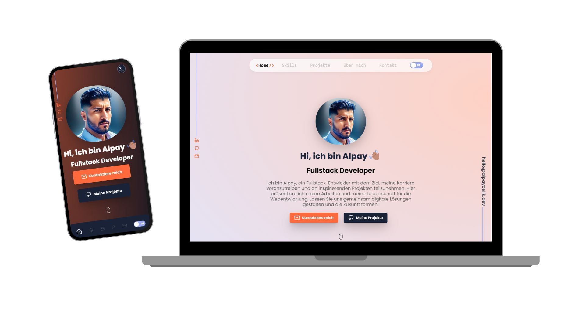

# Portfolio Webseite

Este es un sitio web de portafolio creado con React, Tailwind CSS y TypeScript. El sitio web muestra mis habilidades y proyectos como desarrollador full-stack. Para el formulario de contacto utilicé una API de formspree.

## Demo



También puede consultar la demostración en vivo del sitio web del portafolio. [Aqui](https://).

## Características

- SEO optimizado
- Configuración del usuario almacenada en el almacenamiento de la sesión.
- Modo oscuro y claro disponible.
- Datos comprimidos y cargados de forma diferida.
- Desarrollado primero con la metodología Mobile First, luego para escritorio.
- Compatible con todos los dispositivos móviles, con una bonita y agradable interfaz de usuario.
- Desplazamiento suave en cada sección.
- Contiene animaciones al desplazarse.
- Servicio Uptime con animación en color.

## Instalación

Clonar el repositorio.

```bash
  git clone <reponame>
```

Instalación de dependencias.

```bash
npm i or npm install
```

Iniciar servidor

```bash
npm run dev
```

## Variables de entorno

Para ejecutar este proyecto, deberá agregar las siguientes variables de entorno a su archivo .env. Ver .env-init en el directorio raíz

`API_BASE_URL`

`API_SERVICESTATUS_URL`

## Stack tecnológico

**Client:** React, React Router Dom, Tailwind CSS, Typescript, Axios, Framer Motion, GSAP, Prism React Renderer, React Icons, React Intersection Observer, React Toastify, React Tooltip, Reactjs Popup, Swiper, Rollup Plugin Gzip

**Server:** API de formspree.

## Support

Si encuentra útil este proyecto o le gustaría apoyar mi trabajo, puede ⭐ este repositorio
